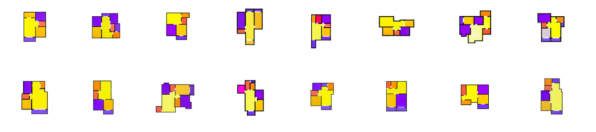
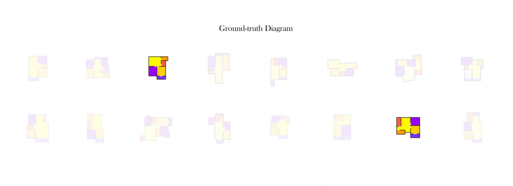
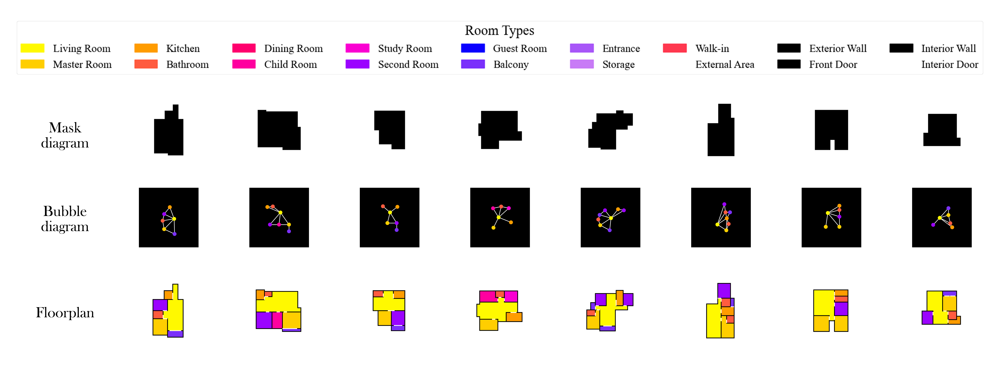
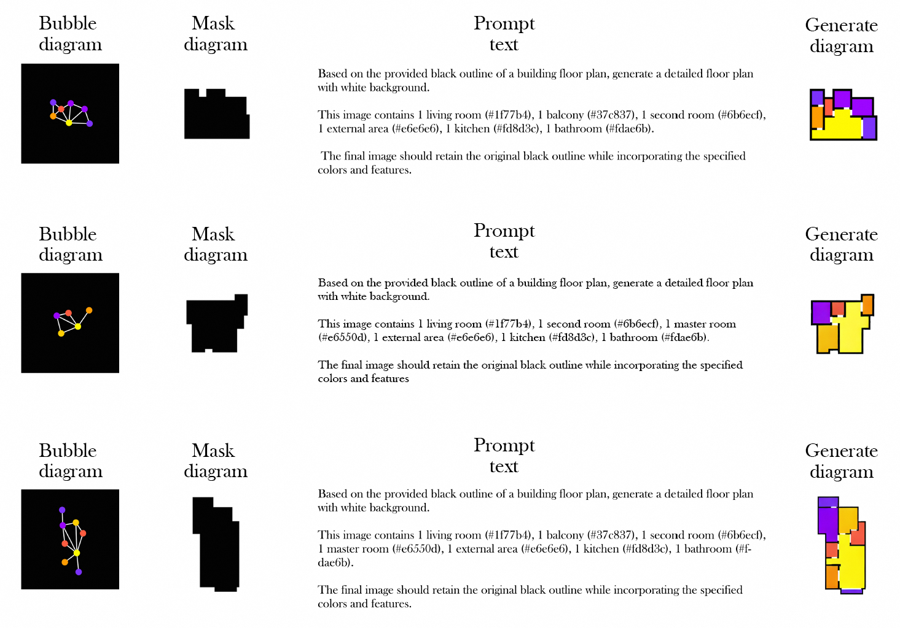

# Floor-ControlNet-FCD 

## Abstract
we propose Floor-Control Net, an innovative method that combines multiple input sources such as Mask Diagrams, Bubble Diagrams, and Design Prompts to improve the accuracy and controllability of generation. Additionally, we have constructed a new customized dataset, the Floor-ControlNet-Dataset (FCD), to support high-accuracy and diverse architectural functional layout generation.Experimental results demonstrate that Floor-Control Net significantly outperforms traditional methods interms of functional layout accuracy, rationality of structural element arrangement, and visual clarity, showcasing broad applicability and scalability.
## Introduction
We presents a new method for generating architectural functional floor plans called Floor-Control Net. It features a double-input control method. By integrating Mask diagrams, Bubble diagrams, and Prompts as inputs, this method enhances the integration of architectural aesthetics with functional requirements. Moreover, Floor-Control Net use a new dataset called Floor-ControlNet-Dataset (FCD)，which is designed specifically for this method. This dataset contain a range of residential floor plans along with corresponding design prompts, in order to make the model in learning the spatial relationships between different functional areas and structural components. By integrating these diverse inputs, the model generates floor plans that excel in functional accuracy and structural consistency. This not only enhances the realism of the generated layouts but provides greater flexibility in adapting to different design constraints, preferences, and architectural styles. Additionally, the dual-input control mechanism allows for finer adjustments to layouts, significantly improving design precision and adaptability. The quality and realism of the generated images highlight the strength of our model. In the presented images, the majority of the areas are actually composed of generated content, which not only maintains exceptional detail, but also seamlessly integrates into the overall design. The generated portions are nearly indistinguishable from the ground-truth images, as Fig show, demonstrating the outstanding performance of our generative model in creating complex and realistic architectural floor plans.

## Dataset SAMPLES
A customized dataset is developed explicitly for Floor-ControlNet, termed as Floor-ControlNet-Dataset (FCD), comprising a rich array of floor plan designs to train the model on complex spatial relationships between functional areas and structural elements. This dataset expands upon the work of earlier works by providing a larger variety of building outlines, functional layout schemas, and well-designed text prompts. The FCD data set encompasses more than 46,000 images, each paired with detailed annotations and conditions that define the spatial relationships and functional requirements of a residential floor plan. 

A new customized dataset has been constructed to meet the needs of a specific building floor plan generation task. This dataset contains rich building outline information, functional layout schemas (bubble diagrams), and design descriptions (prompts), providing more detailed and diverse training data for the model. The salient features of this dataset include diverse building profiles covering different types and styles of building designs, allowing the model to learn and adapt to a wide range of building design patterns during training. In addition, the locations, sizes, and interrelationships of functional areas are accurately labeled in the functional layout schematic to ensure that the model can generate rational and realistic functional layouts. The design description provides precise design requirements and intentions through the detailed design prompt, which enables the model to better understand and capture the designer's needs and preferences during the generation process, thus generating a building floor plan that meets expectations. 

## Cite
* https://paperswithcode.com/dataset/rplan
* https://github.com/lllyasviel/ControlNet
* https://github.com/caspervanengelenburg/ssig
## P.S
Dataset folder contain some demo of our datasets.If you need my dataset,please email me. 377754944@qq.com.
